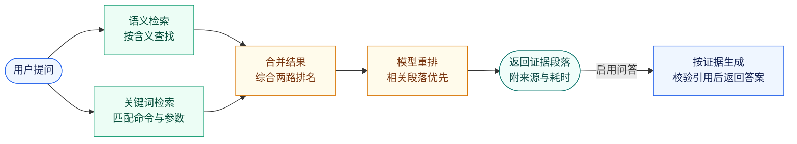

# EvidenceRAG：中文技术文档检索与问答

用自然语言查找 TiDB 中文技术文档，返回相关段落、来源和检索耗时。结合**关键词检索、语义检索和模型重排**，并用可复现的实验检验效果。

**默认返回检索证据；显式启用问答后，可根据证据生成带引用的答案。** 引用可以跳转到本次选入的段落；格式或引用不合法时不发布答案，证据不足时返回拒答。

[检索流程](#检索流程) · [实测效果](#实测效果) · [关键取舍](#关键取舍) · [核心工程](#核心工程) · [快速开始](#快速开始) · [详细评估](docs/evaluation.md)

**实验性文档调查**：在现有检索之上增加受限工具动作、补充搜索、追问、执行预算和调查记录。
可显式启用 `/api/investigate`；实现与离线控制逻辑已验证，真实模型任务效果仍待评测。
运行方式和单轮 RAG / 固定流程 / Agent 对照入口见[文档调查说明](docs/agent.md)，
阶段进度见[迭代计划](docs/agent-iteration.md)。

## 检索流程

技术文档中，命令和参数名需要精确匹配，同一个问题又可能有不同说法。系统分别按关键词和含义查找，再合并候选，用重排模型判断哪些段落更相关。



知识库来自本地下载的 TiDB 文档，提前完成分块与索引；查询时只检索相关段落，不把整套文档交给模型。图中两条检索分支表示不同信号，当前实现按顺序执行。

## 实测效果

<!-- BEGIN TIDB-EVAL-SUMMARY -->
在 **450 篇 TiDB 文档、980 条测试问题**上，比较以下检索方案。问题和相关性标签由同一模型生成、验证和判断，属于合成评测，不是人工标注。

**首条命中率**：排在第一位的段落是否包含可完整回答问题的证据，不是生成答案的正确率。

| 检索方案 | 首条命中率 | 95% 置信区间 |
|---|---:|---:|
| 关键词检索 | 66.0% | [62.6%, 69.5%] |
| 语义检索 | 78.9% | [75.9%, 81.9%] |
| 两路结果融合 | 76.4% | [73.4%, 79.5%] |
| 融合 + 模型重排 | 93.5% | [91.6%, 95.2%] |

<details>
<summary>统计依据与评测边界</summary>

预声明主指标 nDCG@10 衡量前列结果的相关性和排序。重排相对仅融合的差值为 **0.1177 [0.1019, 0.1340]**（配对 95% CI），Holm 校正 p = 0.0004†。本次检验检测到差异；方向以差值为准。
490 组「直接提问 / 换种说法」先在组内取均值，CI 与检验按 245 个来源文档簇重采样。† 表示蒙特卡洛估计触及分辨率下限，不是严格的概率上界。
完整方法和限制见 [评估文档](docs/evaluation.md)。

</details>
<!-- END TIDB-EVAL-SUMMARY -->

本项目不假设“模型更大就一定更好”或“融合一定胜过单路检索”。除上面的领域内评测，还用 CRUD-RAG 新闻基准（5,681 篇文档、2,394 条问题，上游自带证据标注）做消融实验。每一步都问同一个问题：这个改动是真的有效，还是噪声？

<!-- 下表数字于 2026-09-08 从 docs/evaluation.md 对应章节誊抄，不由同步器管理；重跑实验后须手动核对。 -->

| 比较 | 指标 | 差值 | 95% 置信区间 | p 值 | 结论 |
|---|---|---:|---:|---:|---|
| 字符 bigram vs jieba 精确分词 | R@1（单证据） | +1.1pp | — | — | 选 bigram：更准、建索引快 3.8 倍、零依赖 |
| 语义检索 vs 关键词检索 | R@1（单证据） | +2.1pp | [−0.9, +5.1]pp | 0.199 | **不显著**。8B 模型单独用并没有打赢 40 行 BM25 |
| 两路融合 vs 关键词检索 | R@1（单证据） | +4.0pp | — | 0.0016 | 显著。两路判定相反的问题占 19.4%，互补而非冗余 |
| 融合 + 重排 vs 仅融合 | hit@1（单证据） | +6.1pp | [+3.3, +8.8]pp | 0.0003 | 显著。重排是收益最大的一步 |
| 重排前 100 vs 前 50 | hit@1（三个难度层） | 0.0pp | — | 1.000 | 未检出差异，部署选前 50 |
| 向量 1024 维 vs 4096 维 | R@1（单证据） | −0.5pp | — | 0.684 | 未检出差异，存储降 75% |
| 向量 64 维 vs 4096 维 | R@1（单证据） | −4.3pp | — | 0.001† | 显著变差。检验有分辨力，上一行不是检验太钝 |
| 分块 256 / 800 vs 400（TiDB） | MRR@10 | +0.008 / −0.013 | [−0.005, +0.021] / [−0.026, +0.001] | 0.224 / 0.141 | 均未检出差异，400 保留为基准 |

p 值均为配对检验；属于多重比较族的行已经 Holm 校正，「语义 vs 关键词」「融合 vs 关键词」两行是单次比较的原始 p 值。† 表示触及蒙特卡洛分辨率下限。二元指标用精确 McNemar，连续指标用配对 bootstrap。完整表格、按难度分层的结果和复现命令见[评估文档](docs/evaluation.md)。

## 关键取舍

这些决定都有数据支撑，展开可以看到为什么。

<details>
<summary><b>为什么关键词检索用字符 bigram，而不是 jieba 分词</b></summary>

在 5,681 篇语料上，字符 bigram 的单证据 R@1 为 75.9%，jieba 精确模式 74.8%，jieba 搜索模式 73.4%。bigram 建索引快 3.8 倍，且不引入一个 2020 年后再未发版的依赖。更重要的是：Milvus 内置的 `chinese` analyzer 就是 jieba 搜索模式，正是实测最差的那个。所以词法臂不交给数据库分词，而是在客户端算好 BM25 权重，作为稀疏向量写入，数据库只负责内积检索。副作用是绕开了 Milvus Lite 中 IDF 按 segment 局部统计的问题。详见评估文档[「中文 BM25」](docs/evaluation.md#中文-bm25字符-bigram-优于-jieba-分词)与架构文档 §3.3。

</details>

<details>
<summary><b>为什么融合在客户端做，而不是用数据库的 RRFRanker</b></summary>

公式相同，但并列名次的处理不同：本地实现用文档 id 打破并列并用精确求和，服务端按到达顺序；服务端的最终 `limit` 还会在并列边界上直接截断，事后补不回来。离线评估的数字全部来自本地精确 RRF，在线路径如果换成服务端融合，就不再是同一个系统。所以默认路径是两路各取 100 条、本地融合；服务端融合保留为通过对齐测试后的优化项。详见评估文档[「在线链路」](docs/evaluation.md#在线链路把离线证据原样搬上去而不是搬一个像它的东西)。

</details>

<details>
<summary><b>为什么融合单独没有超过语义检索，却仍保留在流程里</b></summary>

上表中「两路结果融合」首条命中率 76.4%，低于「语义检索」的 78.9%。在预声明主指标 nDCG@10 上，两者差值 0.0034，配对 p = 0.646，不可区分；差距主要出现在换种说法的问题上，等权融合继承了关键词检索对措辞变化的敏感。保留融合有两个理由。第一，在 CRUD-RAG 上融合相对关键词检索显著提升，两路判定相反的问题占 19.4%，并集的理论上限比最好的单路高 8.6 个百分点。第二，重排在融合候选上把首条命中率推到 93.5%，融合的作用是给重排一个更完整的候选池，而不是自己排第一。这个数字没有被隐藏，融合权重也没有在 TiDB 评测集上反向调参。

</details>

<details>
<summary><b>为什么重排窗口是 50，不是 100</b></summary>

对每条问题的前 100 个候选统一打分一次，再离线比较只用前 50 个分数和用全部 100 个。三个难度层的 hit@1 逐位相同，完整证据召回最多只差 0.26 个百分点，Holm 校正后 p 全为 1.000。没有检出差异，所以选便宜的那个，但不把「没检出差异」写成「两者等价」。在线实现把请求深度 100 和应用深度 50 分成两个字段，因为「发 100 篇取前 50 个分数」和「只发 50 篇」是两个不同的输入。

</details>

<details>
<summary><b>为什么评测问题由模型生成，而不是人工标注</b></summary>

TiDB 文档没有上游人工标注。980 条问题由模型按主题分层抽样后生成「直接提问」和「换种说法」两种表面形式，再经独立验证轮次过滤，相关性由同一模型在打乱排名、固定顺序的条件下判定。README 里明确写成「同模型自我一致的合成标签」，不冒充独立复核。为了不让同源问题把置信区间做窄，置信区间与检验按 245 个来源文档簇重采样，而不是按 980 条问题。CRUD-RAG 一侧则刻意不用模型扩充问题：从证据文档生成问题会重新引入让官方 500 篇子集饱和的那个缺陷。详见评估文档[「评测集够大吗」](docs/evaluation.md#评测集够大吗)。

</details>

<details>
<summary><b>为什么存 4096 维，1024 维只做离线实验</b></summary>

先验证了供应商的 `dimensions` 参数就是前缀切片加重归一化，所以只存一份 4096 维向量，全部维度档由客户端切片得到，零额外 API 调用。1024 维相对 4096 维 R@1 只差 −0.5 个百分点，p = 0.684，存储降 75%；一直降到 128 维都不显著，64 维才显著变差。但已完成的付费重排实验建立在 4096 维融合上，不能事后把它改名成 1024 维的结果，所以在线路径继续用 4096 维。详见评估文档[「MRL 降维」](docs/evaluation.md#mrl-降维存储降-75r1-无显著损失)。

</details>

<details>
<summary><b>为什么不用 LangChain / LlamaIndex</b></summary>

当前检索流程是固定的三段：两路检索、融合、重排，外加可选生成。几个窄 Protocol 加显式组合根就能表达，编码器、存储、重排器和时钟都可注入，默认 CI 不需要 API key、语料或原生依赖就能验证请求形状、融合顺序和失败边界。引入框架会带来评估中不可控的隐式行为。等真的出现编排需求再引入，而不是先引入再找需求。

</details>

<details>
<summary><b>为什么 TiDB 的文档没有跑在 TiDB 上</b></summary>

仓库里有 TiDB 适配器：原生 VECTOR 列加 HNSW 做向量检索，配套 postings 表做精确稀疏内积，与 Milvus 适配器共用同一个 Protocol。但 TiDB 向量检索仍是 public preview，HNSW 依赖 TiFlash 副本，全文检索限于部分区域且使用自己的分词器。仓库尚无真实 TiDB 实例，因此它是离线认证的合同，不是已验证的生产后端。在真机通过建表、两臂排序、完整行回读、别名切换和重连之前，不声称「双后端跑通」。详见评估文档[对应章节](docs/evaluation.md#为什么-tidb-的文档没有跑在-tidb-上)。

</details>

## 核心工程

| 能力 | 实现 |
|---|---|
| 文档处理 | 按 Markdown 标题分块，合并过短内容，保护代码块和表格 |
| 检索与重排 | 字符 bigram BM25 + Qwen3-Embedding-8B；RRF 合并排名，Qwen3-Reranker-8B 重排 |
| 增量与缓存 | 内容哈希识别变化，复用未变化的文档向量；模型结果缓存可断点续跑 |
| 索引发布 | 先构建新版本、校验后切换别名；词表与索引状态校验不一致时拒绝启动 |
| 接口解耦 | Python Protocol 隔离模型和存储，Milvus Lite 已验证；TiDB 适配器仍待真实实例验证 |
| HTTP 与追踪 | `/api/search` 保留独立检索；`/api/ask` 返回答案与引用，分别记录检索和生成耗时 |
| 问答边界 | 完整段落上下文预算、结构化引用校验、拒答与故障分离；答案不自动落盘 |
| 质量门禁 | pytest、ruff、严格类型检查；GitHub Actions 配置 Ubuntu / Windows 双系统测试 |

<details>
<summary>模块地图：想看某一层的代码从哪里进</summary>

| 目录 | 职责 | 主要文件 |
|---|---|---|
| `src/zhrag/chunking/` | Markdown 两阶段分块，保护代码块与表格 | `markdown.py` |
| `src/zhrag/lexical/` | 字符 n-gram 分析器、Okapi BM25、客户端稀疏向量 | `analyzers.py`、`bm25.py`、`sparse.py` |
| `src/zhrag/retrieval/` | RRF 融合、在线编排（两路各 100 → 本地融合 → 请求 100 / 应用 50 的重排）、Protocol 接缝 | `fusion.py`、`online.py`、`adapters.py` |
| `src/zhrag/store/` | 与厂商无关的 VectorStore Protocol；Milvus 与 TiDB 两个惰性导入的适配器 | `base.py`、`milvus.py`、`tidb.py` |
| `src/zhrag/providers/` | HTTP 传输（显式 UA、长退避、Retry-After）、embedding / rerank / chat 客户端、断点续跑缓存与 provenance sidecar | `http.py`、`embedding.py`、`rerank.py`、`chat.py`、`cache.py` |
| `src/zhrag/answering.py` | 单轮证据问答：上下文预算、结构化引用校验、拒答与故障分离 | 合同见 [docs/answering.md](docs/answering.md) |
| `src/zhrag/service/` | FastAPI 应用、脱敏 trace 合同、HTTP 基准 | `app.py`、`observability.py`、`bench.py`、`static/index.html` |
| `src/zhrag/eval/` | 指标（R@k / MRR / nDCG / bootstrap CI / 精确 McNemar / Holm）、CRUD-RAG 语料重建、TiDB 合成评测集生成、pooling、qrels 与质量报告 | `metrics.py`、`crud.py`、`qgen.py`、`pool.py`、`tidb_quality.py` |
| `src/zhrag/ingest.py` | manifest 校验、内容哈希变更检测、文档级增量 | — |
| `src/zhrag/io_utils.py`、`tokens.py` | 唯一的 UTF-8 文件出入口；按 Qwen3 tokenizer 标定的 token 估算 | — |
| `scripts/` | 构建、评测、基准、文档同步的命令行入口，付费步骤全部需显式开启 | `build_index.py`、`serve.py`、`evaluate_*.py`、`sync_*_docs.py` |
| `tests/` | 全部使用合成数据，不需要 API key、语料或数据库 | — |

</details>

<!-- BEGIN QUALITY-GATE-STATUS -->`pytest` 1,498 passed；ruff 和 mypy 作为独立门禁。<!-- END QUALITY-GATE-STATUS -->

<!-- BEGIN M8-README-HEADLINE -->本机 HTTP 基准（980 次正式请求，并发 1，查询向量走本地缓存、未启用重排，不含模型调用耗时）：p50 197.4 ms，p95 228.3 ms，吞吐 4.97 QPS，成功 980/980。<!-- END M8-README-HEADLINE -->

p95 表示约 95% 请求不超过该耗时。这是本机基准，不是公网服务承诺；**检索质量实验启用了重排，当前性能基准未启用，两者不是同一配置**。

## 快速开始

需要 Python 3.13 和 [uv](https://docs.astral.sh/uv/)。以下命令均在仓库根目录运行。

### 运行测试

```bash
uv sync --extra dev --extra service --python 3.13
uv run pytest
uv run ruff check src tests scripts
uv run ruff format --check src tests scripts
uv run mypy
```

测试使用合成数据，不需要 API key、真实语料或数据库。`service` 安装 HTTP 层依赖，不会调用外部模型。

### 启动检索服务

首次运行需要获取语料并建立索引，这不是开箱即用的离线演示。

1. 按[数据准备说明](DATA_LICENSE.md#3-如何在本地获得数据)下载 TiDB 文档。下载脚本使用 PowerShell；Linux/macOS 需安装 `pwsh`。
2. 在本地 `.env` 配置服务商提供的 `Embedding_BASE_URL`、`Embedding_API_KEY`、`Embedding_MODEL_NAME`，以及 `ReRank_BASE_URL`、`ReRank_API_KEY`、`ReRank_MODEL_NAME`。当前验证过的模型为上表的 Qwen3 模型，其他端点需单独验证。
3. 安装本地存储依赖，先预览构建计划，再显式开启付费嵌入和索引发布：

```bash
# 显式安装 Lite，覆盖 Windows 上 pymilvus 不自动安装它的情况
uv run --extra service --extra milvus --with milvus-lite==3.2.0 \
  python scripts/build_index.py --dry-run

# 新增向量会调用付费 embedding API
uv run --extra service --extra milvus --with milvus-lite==3.2.0 \
  python scripts/build_index.py --embed --publish

uv run --extra service --extra milvus --with milvus-lite==3.2.0 \
  python scripts/serve.py
```

打开 **http://127.0.0.1:8000** 进入检索页面。默认每次查询调用 embedding 和 rerank API，可能产生费用。已有完整评估缓存时，可用 `--query-cache` 启动不调用模型的限定查询服务，见[缓存演示说明](docs/evaluation.md#缓存演示与文档同步)。

本地代理可能干扰 Milvus Lite 连接；请把 `127.0.0.1,localhost` 加入 `NO_PROXY` / `no_proxy`。

### 启用单轮问答

另在 `.env` 配置 `LLM_BASE_URL`、`LLM_API_KEY`、`LLM_MODEL_NAME`，并显式启用：

```bash
uv run --extra service --extra milvus --with milvus-lite==3.2.0 \
  python scripts/serve.py --enable-generation
```

页面可切换“问答 / 检索”。问答会额外调用 chat API，产生费用；`--enable-generation` 不能和 `--query-cache` 一起使用。模型端点须支持 JSON mode 与 `max_completion_tokens`，不支持时直接报错，不会自动改成无输出上限请求。生成阶段的指定 HTTP 错误（含 401）和网络瞬态故障默认阶梯重试，可能长时间等待并重复计费；用 `--generation-retries 0` 关闭，详见[重试策略](docs/answering.md#生成重试)。

## 文档与许可

| 内容 | 入口 |
|---|---|
| 完整实验表格、统计方法与复现命令 | [评估文档](docs/evaluation.md) |
| 技术选型、路线图与待验证清单 | [架构决策](docs/architecture-decision.md) |
| 数据来源、下载方式与许可边界 | [数据说明](DATA_LICENSE.md) |

代码按 Apache-2.0 授权声明。语料、分块、向量、模型打分与生成文本不提交到仓库，也不适用代码许可证。TiDB 文档采用 CC BY-SA 3.0；CRUD-RAG 的许可审计结果和使用边界见[数据说明](DATA_LICENSE.md)。
