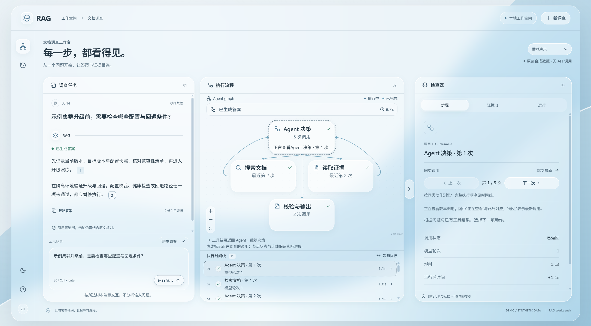
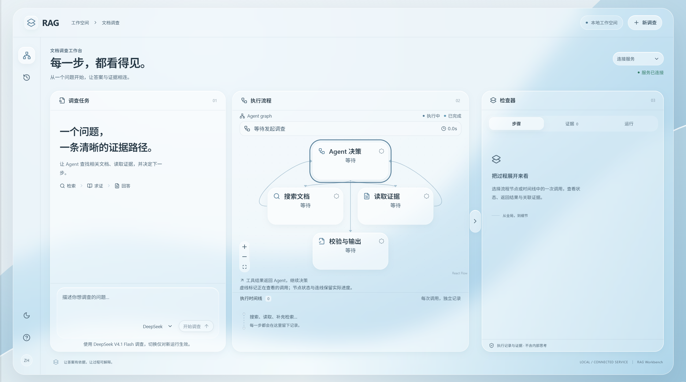
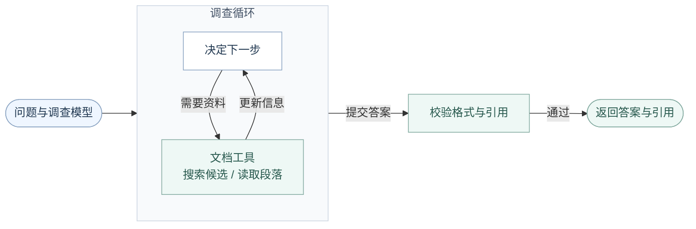
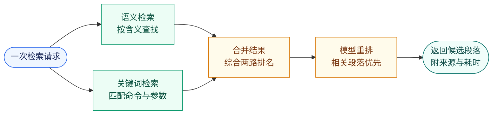

# EvidenceRAG：中文技术文档 RAG 与可追溯 Agent 工作台

面向 TiDB 中文技术文档的检索与问答系统，结合 **BM25、Qwen3 向量检索、RRF 融合与模型重排**，支持带引用的单轮问答，以及按需搜索、读取证据的文档调查 Agent。

提供 React 可视化工作台，展示工具调用、执行进度与引用原文；通过 CRUD-RAG 与 TiDB 领域评测，对检索策略、向量维度和重排窗口进行可复现的实验验证。

[调查工作台](#调查工作台) · [调查与检索流程](#调查与检索流程) · [项目亮点](#项目亮点) · [实测效果](#实测效果) · [快速开始](#快速开始) · [核心工程](#核心工程) · [关键取舍](#关键取舍) · [详细评估](docs/evaluation.md)

## 调查工作台

从问题到带引用的答案，工作台展示每次搜索、证据读取与执行状态。点击引用对照原文，选择流程节点或时间线记录查看单次调用详情。



*原创合成演示：展示带引用的答案、执行流程与调用详情；无需密钥，不调用模型。*

<details>
<summary>查看服务连接与模型选择</summary>



连接已配置的后端服务后，可选择 DeepSeek 或 GLM；每次调查固定使用所选模型，历史记录保留当次模型。

</details>

[体验模拟演示](#体验调查工作台) · [演示指南](docs/workbench-demo.md) · [连接服务与模型配置](docs/frontend.md)

## 调查与检索流程

**实验性文档调查**：在现有检索之上增加受限工具动作、补充搜索、追问、执行预算和调查记录。
提供 `/api/investigate` 与实时进度接口 `/api/investigate/stream`。已有真实链路与引用核验记录，系统质量和稳定性仍待评测；模拟演示不代表模型效果。
运行方式和单轮 RAG / 固定流程 / Agent 对照入口见[文档调查说明](docs/agent.md)，
阶段进度见[迭代计划](docs/agent-iteration.md)。

### 文档调查：搜索、读取，再决定下一步

连接服务后，工作台将问题和选定的模型交给后端。一次调查固定使用该模型；模型提出动作，程序验证后执行。搜索先返回候选编号与摘要，只有读取过的完整段落才能作为答案引用。



图中保留形成答案的主线；调查循环可多次选择搜索或读取，并不要求两种动作固定交替。未返回答案时，工作台会展示对应状态：

| 结束情况 | 页面反馈 |
|---|---|
| 缺少必要信息 | 追问需要补充的内容 |
| 证据不足 | 说明无法支撑结论 |
| 预算耗尽或取消 | 展示停止原因，保留已完成记录 |
| 因故障或校验失败结束 | 展示错误原因，不发布未通过校验的答案 |

工作台通过 SSE 展示执行进度，最终呈现答案、追问或终止原因；网页进度流与供应商是否流式生成无关。补充信息需与原问题一起发起新调查，当前不保存多轮会话。

图中展示基本调查流程。需求规划和答案复核是独立、默认关闭的可选能力，见[调查合同](docs/agent.md)。格式和引用校验通过不代表结论已通过独立质量验收；预算与取消在调用边界检查，不保证立即停止正在进行的模型调用。

### 共用检索流程

技术文档中，命令和参数名需要精确匹配，同一个问题又可能有不同说法。系统分别按关键词和含义查找，再合并候选，用重排模型判断哪些段落更相关。独立检索、单轮问答和调查中的每次搜索都复用这条路径。



知识库来自本地下载的 TiDB 文档，提前完成分块与索引；查询时只检索相关段落，不把整套文档交给模型。图中两条检索分支表示不同信号，当前实现按顺序执行。

| 使用方式 | 接口 | 检索之后 |
|---|---|---|
| 独立检索 | `/api/search` | 返回段落、来源和耗时 |
| 单轮问答 | `/api/ask` | 在上下文预算内选入完整段落，生成并校验带引用答案；证据不足时拒答 |
| 文档调查 | `/api/investigate`、`/api/investigate/stream` | 先查看候选摘要，再按需读取完整段落；可补充搜索、追问或结束，过程受预算约束 |

## 项目亮点

- **用实验支撑检索选型**：对比关键词检索、语义检索、融合与重排，结合配对检验和置信区间评估收益，并通过扩展干扰语料改善小语料评测的区分度。
- **实现可追溯的文档调查 Agent**：模型按需搜索与读取证据，程序约束工具动作、执行预算和引用来源，工作台支持逐次查看调用记录与原文。
- **维护离线评测与在线行为的一致性**：显式控制词法权重、融合排序和截断规则，结合增量索引、缓存复用及跨平台 CI，让实验结果能够对应实际实现。

## 实测效果

<!-- BEGIN TIDB-EVAL-SUMMARY -->
在 **450 篇 TiDB 文档、980 条测试问题**上，比较以下检索方案。问题和相关性标签由同一模型生成、验证和判断，属于合成评测，不是人工标注。

**首条命中率**：排在第一位的段落是否包含可完整回答问题的证据，不是生成答案的正确率。

| 检索方案 | 首条命中率 | 95% 置信区间 |
|---|---:|---:|
| 关键词检索 | 66.0% | [62.6%, 69.5%] |
| 语义检索 | 78.9% | [75.9%, 81.9%] |
| 两路结果融合 | 76.4% | [73.4%, 79.5%] |
| 融合 + 模型重排 | 93.5% | [91.6%, 95.2%] |

<details>
<summary>统计依据与评测边界</summary>

预声明主指标 nDCG@10 衡量前列结果的相关性和排序。重排相对仅融合的差值为 **0.1177 [0.1019, 0.1340]**（配对 95% CI），Holm 校正 p = 0.0004†。本次检验检测到差异；方向以差值为准。
490 组「直接提问 / 换种说法」先在组内取均值，CI 与检验按 245 个来源文档簇重采样。† 表示蒙特卡洛估计触及分辨率下限，不是严格的概率上界。
完整方法和限制见 [评估文档](docs/evaluation.md)。

</details>
<!-- END TIDB-EVAL-SUMMARY -->

本项目不假设“模型更大就一定更好”或“融合一定胜过单路检索”。除上面的领域内评测，还用带上游证据标注的 CRUD-RAG 新闻基准做消融实验，区分观察到的改进与抽样不确定性。

<details>
<summary>查看完整消融表与统计口径</summary>

<!-- BEGIN ABLATION-SUMMARY -->
由 `scripts/sync_ablation_docs.py` 从完整本地缓存离线重算；差值均为前者减后者。
CRUD 使用 5,681 篇文档；原单证据任务为 800 条，重排按实际 gold 数对全部 2,394 条分层。
TiDB 分块是独立的 source-level known-item 实验，不与 CRUD 文档级结果混合。

| 比较 | 指标与范围 | 差值 | 配对 95% 置信区间 | p 值 | 检验口径 |
|---|---|---:|---:|---:|---|
| 语义检索 vs 关键词检索 | R@1（原单证据任务） | +2.12pp | [-1.00, +5.25]pp | 0.1986 | 双尾精确 McNemar；原始 p |
| 两路融合 vs 关键词检索 | R@1（原单证据任务） | +4.00pp | [+1.62, +6.50]pp | 0.0016 | 双尾精确 McNemar；探索性原始 p |
| 融合 + 重排前 50 vs 仅融合 | hit@1（实际 1 个 gold） | +6.06pp | [+3.34, +8.78]pp | 0.0003 | 双尾精确 McNemar；效益十二项 Holm |
| 重排前 100 vs 前 50（arity=1） | hit@1（实际 1 个 gold） | +0.00pp | [+0.00, +0.00]pp | 1.0000 | 双尾精确 McNemar；深度六项 Holm |
| 重排前 100 vs 前 50（arity=2） | hit@1（实际 2 个 gold） | +0.00pp | [+0.00, +0.00]pp | 1.0000 | 双尾精确 McNemar；深度六项 Holm |
| 重排前 100 vs 前 50（arity=3） | hit@1（实际 3 个 gold） | +0.00pp | [+0.00, +0.00]pp | 1.0000 | 双尾精确 McNemar；深度六项 Holm |
| 向量 1024 维 vs 4096 维 | R@1（原单证据任务） | -0.50pp | [-1.62, +0.62]pp | 0.6839 | 单尾配对 bootstrap；六项 Holm |
| 向量 64 维 vs 4096 维 | R@1（原单证据任务） | -4.25pp | [-6.38, -2.00]pp | 0.0006† | 单尾配对 bootstrap；六项 Holm |
| TiDB 分块 tidb-chunk-t256-h384-v1-vs-tidb-chunk-t400-h600-v1 | origin-source MRR@10 | +0.0080 | [-0.0049, +0.0206] | 0.2239 | 双尾来源簇配对 bootstrap；两项 Holm |
| TiDB 分块 tidb-chunk-t800-h1200-v1-vs-tidb-chunk-t400-h600-v1 | origin-source MRR@10 | -0.0125 | [-0.0262, +0.0009] | 0.1406 | 双尾来源簇配对 bootstrap；两项 Holm |

差值区间使用 10,000 次重采样、seed=0；TiDB 按来源簇重采样，其余按查询配对。
MRL 保留历史的单尾退化检验及完整六项比较族；R@1 在这组单证据任务上仍是二元指标。
† 表示 Holm 结果继承蒙特卡洛分辨率下限。未检出差异不证明等价或对小效应有足够功效。
融合对 BM25 的历史比较来自同批数据上的融合选型，原始 p 未校正该选择，按探索性结果解释。
词法 analyzer 只保留描述性比较；其原始表、重排完整族和历史报告见详细评估文档。
<!-- END ABLATION-SUMMARY -->

</details>

完整结果与同步命令见[评估文档](docs/evaluation.md#消融摘要的离线重算)。

## 快速开始

以下命令均在仓库根目录运行。模拟演示需要 Node.js 22.12+ 和 npm；后端服务与 Python 测试需要 Python 3.13 和 [uv](https://docs.astral.sh/uv/)。

**后端默认只启用检索，问答与文档调查需分别开启；** 真实回答的引用可定位到本次证据，格式或引用不合法时不发布答案。

### 体验调查工作台

```bash
npm --prefix frontend ci
npm --prefix frontend run dev
```

打开 [调查工作台](http://127.0.0.1:5173/workbench/)，点击“运行演示”。默认按预设场景展示调查过程，不调用模型，不需要密钥、语料或后端服务。

本地生产构建预览及“完整调查、需要补充信息、证据不足”的操作见[演示指南](docs/workbench-demo.md)。连接自己的服务与模型配置见[工作台说明](docs/frontend.md)。

### 运行测试

```bash
uv sync --extra dev --extra service --python 3.13
uv run pytest
uv run ruff check src tests scripts
uv run ruff format --check src tests scripts
uv run mypy
```

测试使用合成数据，不需要 API key、真实语料或数据库。`service` 安装 HTTP 层依赖，不会调用外部模型。

### 启动检索服务

首次运行需要获取语料并建立索引，这不是开箱即用的离线演示。

1. 按[数据准备说明](DATA_LICENSE.md#3-如何在本地获得数据)下载 TiDB 文档。下载脚本使用 PowerShell；Linux/macOS 需安装 `pwsh`。
2. 在本地 `.env` 配置服务商提供的 `Embedding_BASE_URL`、`Embedding_API_KEY`、`Embedding_MODEL_NAME`，以及 `ReRank_BASE_URL`、`ReRank_API_KEY`、`ReRank_MODEL_NAME`。当前验证过的模型为[核心工程](#核心工程)中列出的 Qwen3 模型，其他端点需单独验证。
3. 安装本地存储依赖，先预览构建计划，再显式开启付费嵌入和索引发布：

```bash
# 显式安装 Lite，覆盖 Windows 上 pymilvus 不自动安装它的情况
uv run --extra service --extra milvus --with milvus-lite==3.2.0 \
  python scripts/build_index.py --dry-run

# 新增向量会调用付费 embedding API
uv run --extra service --extra milvus --with milvus-lite==3.2.0 \
  python scripts/build_index.py --embed --publish

uv run --extra service --extra milvus --with milvus-lite==3.2.0 \
  python scripts/serve.py
```

打开 **http://127.0.0.1:8000** 进入检索页面。默认每次查询调用 embedding 和 rerank API，可能产生费用。已有完整评估缓存时，可用 `--query-cache` 启动不调用模型的限定查询服务，见[缓存演示说明](docs/evaluation.md#缓存演示与文档同步)。

本地代理可能干扰 Milvus Lite 连接；请把 `127.0.0.1,localhost` 加入 `NO_PROXY` / `no_proxy`。

### 启用单轮问答

另在 `.env` 配置 `LLM_BASE_URL`、`LLM_API_KEY`、`LLM_MODEL_NAME`，并显式启用：

```bash
uv run --extra service --extra milvus --with milvus-lite==3.2.0 \
  python scripts/serve.py --enable-generation
```

页面可切换“问答 / 检索”。问答会额外调用 chat API，产生费用；`--enable-generation` 不能和 `--query-cache` 一起使用。模型端点须支持 JSON mode 与 `max_completion_tokens`，不支持时直接报错，不会自动改成无输出上限请求。生成阶段的指定 HTTP 错误（含 401）和网络瞬态故障默认阶梯重试，可能长时间等待并重复计费；用 `--generation-retries 0` 关闭，详见[重试策略](docs/answering.md#生成重试)。

## 核心工程

| 能力 | 实现 |
|---|---|
| 文档处理 | 按 Markdown 标题分块，合并过短内容，保护代码块和表格 |
| 检索与重排 | 字符 bigram BM25 + Qwen3-Embedding-8B；RRF 合并排名，Qwen3-Reranker-8B 重排 |
| 增量与缓存 | 内容哈希识别变化，复用未变化的文档向量；模型结果缓存可断点续跑 |
| 索引发布 | 先构建新版本、校验后切换别名；词表与索引状态校验不一致时拒绝启动 |
| 接口解耦 | Python Protocol 隔离模型和存储，Milvus Lite 已验证；TiDB 适配器仍待真实实例验证 |
| HTTP 与进度 | 独立检索、单轮问答与文档调查各有接口；调查提供 SSE 动作进度，检索 trace 与生成耗时分别记录 |
| 问答边界 | 完整段落上下文预算、结构化引用校验、拒答与故障分离；答案不自动落盘 |
| 受限调查 | 搜索与读取动作经过白名单验证；每次请求固定模型，支持追问、补充检索、预算与合作取消 |
| 调查工作台 | 展示逐次搜索与读取记录，点击答案引用对照原文；支持模型选择和模拟演示 |
| 质量门禁 | Python 使用 pytest、ruff、严格类型检查及 Ubuntu / Windows 双系统 CI；前端使用单测、构建与合成浏览器回归 |

<details>
<summary>模块地图：想看某一层的代码从哪里进</summary>

| 目录 | 职责 | 主要文件 |
|---|---|---|
| `src/zhrag/chunking/` | Markdown 两阶段分块，保护代码块与表格 | `markdown.py` |
| `src/zhrag/lexical/` | 字符 n-gram 分析器、Okapi BM25、客户端稀疏向量 | `analyzers.py`、`bm25.py`、`sparse.py` |
| `src/zhrag/retrieval/` | RRF 融合、在线编排（两路各 100 → 本地融合 → 请求 100 / 应用 50 的重排）、Protocol 接缝 | `fusion.py`、`online.py`、`adapters.py` |
| `src/zhrag/store/` | 与厂商无关的 VectorStore Protocol；Milvus 与 TiDB 两个惰性导入的适配器 | `base.py`、`milvus.py`、`tidb.py` |
| `src/zhrag/providers/` | embedding / rerank / chat 客户端、缓存与 provenance；在线生成另有直连传输、可选流式、独立重试和模型身份校验 | `http.py`、`cache.py`、`answering.py`、`direct.py`、`streaming.py`、`model_identity.py` |
| `src/zhrag/answering.py` | 单轮证据问答：上下文预算、结构化引用校验、拒答与故障分离 | 合同见 [docs/answering.md](docs/answering.md) |
| `src/zhrag/agent.py` | 受限调查循环、证据读取与执行预算；可选需求规划、覆盖门禁和答案复核 | `agent_planning.py`、`agent_answer_review.py`；合同见 [docs/agent.md](docs/agent.md) |
| `src/zhrag/service/` | FastAPI 应用、调查 SSE、脱敏检索 trace 合同、HTTP 基准 | `app.py`、`agent_stream.py`、`observability.py`、`bench.py`、`static/index.html` |
| `frontend/` | React 调查工作台：执行流程、调用记录、引用阅读与模型选择 | 使用方式见 [docs/frontend.md](docs/frontend.md) |
| `src/zhrag/eval/` | 指标（R@k / MRR / nDCG / bootstrap CI / 精确 McNemar / Holm）、CRUD-RAG 语料重建、TiDB 合成评测集生成、pooling、qrels 与质量报告 | `metrics.py`、`crud.py`、`qgen.py`、`pool.py`、`tidb_quality.py` |
| `src/zhrag/ingest.py` | manifest 校验、内容哈希变更检测、文档级增量 | — |
| `src/zhrag/io_utils.py`、`tokens.py` | 唯一的 UTF-8 文件出入口；按 Qwen3 tokenizer 标定的 token 估算 | — |
| `scripts/` | 构建、评测、基准、文档同步的命令行入口，付费步骤全部需显式开启 | `build_index.py`、`serve.py`、`evaluate_*.py`、`sync_*_docs.py` |
| `tests/` | 全部使用合成数据，不需要 API key、语料或数据库 | — |

</details>

<!-- BEGIN QUALITY-GATE-STATUS -->`pytest` 1,779 passed；ruff 和 mypy 作为独立门禁。<!-- END QUALITY-GATE-STATUS -->

<!-- BEGIN M8-README-HEADLINE -->本机 HTTP 基准（980 次正式请求，并发 1，查询向量走本地缓存、未启用重排，不含模型调用耗时）：p50 197.4 ms，p95 228.3 ms，吞吐 4.97 QPS，成功 980/980。<!-- END M8-README-HEADLINE -->

p95 表示约 95% 请求不超过该耗时。这是本机基准，不是公网服务承诺；**检索质量实验启用了重排，当前性能基准未启用，两者不是同一配置**。

## 关键取舍

以下选择来自检索实验和实际工程约束，分别说明选择依据、维护代价与适用范围。实验数值、置信区间和配对检验见上方[实测效果](#实测效果)。

<details>
<summary><b>为什么重建评测集，并保留新闻与 TiDB 两套基准？</b></summary>

早期的小语料评测中，简单 BM25 已接近满分，难以区分检索方案。因此先扩展干扰语料，保留上游证据标注，再比较首条命中率和排序质量；评测集本身能否暴露差异，也是需要验证的对象。

CRUD-RAG 新闻基准用于可重复的方案对照，TiDB 评测则检查最终技术文档场景中的术语与提问改写。代价是维护两套数据和评测流程，但可以分别观察基准表现与领域表现。TiDB 的问题和相关性标签由同一模型生成、验证和判断，按合成评测报告，并按来源文档簇统计不确定性。详见[评测设计与数据边界](docs/evaluation.md)。

</details>

<details>
<summary><b>为什么保留关键词检索，并在融合后加入重排？</b></summary>

技术文档既有需要精确匹配的命令、参数名，也有表达不同但含义相近的问题。关键词与语义检索提供不同线索，融合先合并两路候选，再由重排模型判断哪些段落更相关。词法臂选择字符 bigram：已有客户端对照中，它相对 jieba 精确与搜索模式的首条命中率点估计更高，构建更快，也省去了分词依赖。

本次 TiDB 合成评测中，重排相对仅融合的提升有配对区间和检验支持，见上方结果；融合本身并不自动优于语义单臂。增加词法臂和重排会带来维护与调用成本，因此单臂、融合和重排结果分别保留，用来检查每一步的实际贡献。详见[词法对照](docs/evaluation.md#中文-bm25字符-bigram-优于-jieba-分词)与[检索消融](docs/evaluation.md#消融摘要的离线重算)。

</details>

<details>
<summary><b>为什么在客户端计算 BM25 和融合排名？</b></summary>

为了让线上执行对应离线评测，项目在客户端生成 BM25 权重，将词表与索引状态一起发布，再把稀疏向量交给数据库检索。两路排名返回后，由客户端执行 RRF，并固定并列排序和截断规则。数据库的分词器、IDF 统计范围或排名处理一旦改变，都可能让线上结果偏离已评测的方案。

代价是自己维护词法索引元数据与融合代码；收益是这些规则可以独立测试，也能在不同存储适配器之间复用。更换后端时仍需验证两臂检索与完整段落回读，不能仅凭接口相同就认定结果一致。详见[线上检索合同](docs/evaluation.md#在线链路把离线证据原样搬上去而不是搬一个像它的东西)。

</details>

<details>
<summary><b>为什么同时提供单轮问答和受限文档调查？</b></summary>

单轮问答直接基于一次检索组织答案；跨文档问题则可能需要补充搜索，或先确认用户的环境信息。因此保留单轮问答入口，同时提供独立启用的调查循环。调查会产生多轮模型和工具调用，需要付出额外的时间与费用。

模型选择搜索、读取、追问或结束，程序校验动作白名单、证据引用和执行预算。当前只开放文档搜索与读取，答案只能引用本次实际读取的段落，工作台可逐次检查调用记录。程序负责执行约束和出处校验；引用是否支持结论，以及调查是否整体优于单轮问答，仍需单独质量评测。详见[调查合同与对照入口](docs/agent.md)。

</details>

<details>
<summary><b>如何选择向量维度和重排窗口？</b></summary>

先复用已有缓存做配对实验，再决定是否更改线上配置。MRL 降维从完整向量取前缀并重新归一化，无需新增嵌入请求；各维度的差值区间见上方摘要。服务仍保留 4096 维，因为已完成的重排实验绑定这套融合候选；切换到 1024 维，需要对新的候选与重排结果独立验证。

重排实验对前 100 个候选统一打分，再比较应用前 50 个分数与应用全部分数。本次分层比较未检出扩大应用窗口的额外收益，当前应用前 50 条。详见[维度与重排窗口对照](docs/evaluation.md#消融摘要的离线重算)。

</details>

<details>
<summary><b>为什么不用 LangChain / LlamaIndex？</b></summary>

项目需要明确控制候选排序、缓存身份、生成重试和调查预算。当前用窄 Protocol 连接检索、存储与模型，用显式循环编排文档调查，让这些行为能够独立测试，并纳入配置与运行记录。模型、存储和时钟都可替换为测试实现，默认 CI 无需 API key、语料或真实数据库。

代价是自行维护流程编排和适配代码。现有固定检索流程与受限调查循环可以由这层代码覆盖，因此暂未引入通用框架。后续增加工具或复杂工作流时，会根据维护成本重新评估框架，同时保留已有的排序、预算和评测合同。详见[架构决策](docs/architecture-decision.md)。

</details>

## 文档与许可

| 内容 | 入口 |
|---|---|
| 调查工作台、模拟演示与模型配置 | [工作台说明](docs/frontend.md) |
| 完整实验表格、统计方法与复现命令 | [评估文档](docs/evaluation.md) |
| 技术选型、路线图与待验证清单 | [架构决策](docs/architecture-decision.md) |
| 数据来源、下载方式与许可边界 | [数据说明](DATA_LICENSE.md) |

代码按 Apache-2.0 授权声明。语料、分块、向量、模型打分与生成文本不提交到仓库，也不适用代码许可证。TiDB 文档采用 CC BY-SA 3.0；CRUD-RAG 的许可审计结果和使用边界见[数据说明](DATA_LICENSE.md)。
