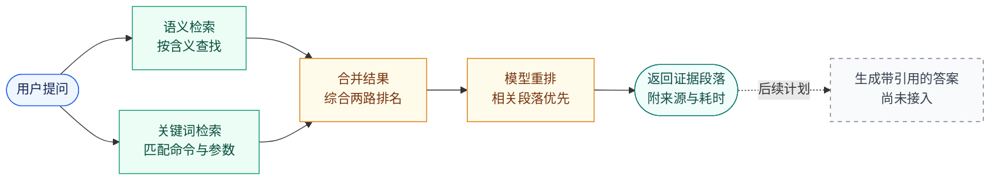

# zhrag：中文技术文档检索系统

用自然语言查找 TiDB 中文技术文档，返回相关段落、来源和检索耗时。结合**关键词检索、语义检索和模型重排**，并用可复现的实验检验效果。

**当前返回带来源的检索证据，不生成最终答案。** 基于证据生成答案与引用校验列入后续计划。

[检索流程](#检索流程) · [实测效果](#实测效果) · [快速开始](#快速开始) · [详细评估](docs/evaluation.md)

## 检索流程

技术文档中，命令和参数名需要精确匹配，同一个问题又可能有不同说法。系统分别按关键词和含义查找，再合并候选，用重排模型判断哪些段落更相关。



知识库来自本地下载的 TiDB 文档，提前完成分块与索引；查询时只检索相关段落，不把整套文档交给模型。图中两条检索分支表示不同信号，当前实现按顺序执行。

## 实测效果

<!-- BEGIN TIDB-EVAL-SUMMARY -->
在 **450 篇 TiDB 文档、980 条测试问题**上，比较以下检索方案。问题和相关性标签由同一模型生成、验证和判断，属于合成评测，不是人工标注。

**首条命中率**：排在第一位的段落是否包含可完整回答问题的证据，不是生成答案的正确率。

| 检索方案 | 首条命中率 | 95% 置信区间 |
|---|---:|---:|
| 关键词检索 | 66.0% | [62.6%, 69.5%] |
| 语义检索 | 78.9% | [75.9%, 81.9%] |
| 两路结果融合 | 76.4% | [73.4%, 79.5%] |
| 融合 + 模型重排 | 93.5% | [91.6%, 95.2%] |

<details>
<summary>统计依据与评测边界</summary>

预声明主指标 nDCG@10 衡量前列结果的相关性和排序。重排相对仅融合的差值为 **0.1177 [0.1019, 0.1340]**（配对 95% CI），Holm 校正 p = 0.0004†。本次检验检测到差异；方向以差值为准。
490 组「直接提问 / 换种说法」先在组内取均值，CI 与检验按 245 个来源文档簇重采样。† 表示蒙特卡洛估计触及分辨率下限，不是严格的概率上界。
完整方法和限制见 [评估文档](docs/evaluation.md)。

</details>
<!-- END TIDB-EVAL-SUMMARY -->

本项目不假设“模型更大就一定更好”或“融合一定胜过单路检索”。除上面的领域内评测，还用 CRUD-RAG 新闻基准进行分词、向量维度和重排窗口的消融实验；完整实验过程保存在[评估文档](docs/evaluation.md)。

## 核心工程

| 能力 | 实现 |
|---|---|
| 文档处理 | 按 Markdown 标题分块，合并过短内容，保护代码块和表格 |
| 检索与重排 | 字符 bigram BM25 + Qwen3-Embedding-8B；RRF 合并排名，Qwen3-Reranker-8B 重排 |
| 增量与缓存 | 内容哈希识别变化，复用未变化的文档向量；模型结果缓存可断点续跑 |
| 索引发布 | 先构建新版本、校验后切换别名；词表与索引状态校验不一致时拒绝启动 |
| 接口解耦 | Python Protocol 隔离模型和存储，Milvus Lite 已验证；TiDB 适配器仍待真实实例验证 |
| HTTP 与追踪 | FastAPI + 静态检索页面，返回阶段耗时；追踪事件只记录脱敏计数、耗时和配置指纹 |
| 质量门禁 | pytest、ruff、严格类型检查；GitHub Actions 配置 Ubuntu / Windows 双系统测试 |

<!-- BEGIN QUALITY-GATE-STATUS -->`pytest` 1,216 passed；ruff 和 mypy 作为独立门禁。<!-- END QUALITY-GATE-STATUS -->

<!-- BEGIN M8-README-HEADLINE -->本机 HTTP 基准（980 次正式请求，并发 1，查询向量走本地缓存、未启用重排，不含模型调用耗时）：p50 197.4 ms，p95 228.3 ms，吞吐 4.97 QPS，成功 980/980。<!-- END M8-README-HEADLINE -->

p95 表示约 95% 请求不超过该耗时。这是本机基准，不是公网服务承诺；**检索质量实验启用了重排，当前性能基准未启用，两者不是同一配置**。

## 快速开始

需要 Python 3.13 和 [uv](https://docs.astral.sh/uv/)。以下命令均在仓库根目录运行。

### 运行测试

```bash
uv sync --extra dev --extra service --python 3.13
uv run pytest
uv run ruff check src tests scripts
uv run ruff format --check src tests scripts
uv run mypy
```

测试使用合成数据，不需要 API key、真实语料或数据库。`service` 安装 HTTP 层依赖，不会调用外部模型。

### 启动检索服务

首次运行需要获取语料并建立索引，这不是开箱即用的离线演示。

1. 按[数据准备说明](DATA_LICENSE.md#3-如何在本地获得数据)下载 TiDB 文档。下载脚本使用 PowerShell；Linux/macOS 需安装 `pwsh`。
2. 在本地 `.env` 配置服务商提供的 `Embedding_BASE_URL`、`Embedding_API_KEY`、`Embedding_MODEL_NAME`，以及 `ReRank_BASE_URL`、`ReRank_API_KEY`、`ReRank_MODEL_NAME`。当前验证过的模型为上表的 Qwen3 模型，其他端点需单独验证。
3. 安装本地存储依赖，先预览构建计划，再显式开启付费嵌入和索引发布：

```bash
# 显式安装 Lite，覆盖 Windows 上 pymilvus 不自动安装它的情况
uv run --extra service --extra milvus --with milvus-lite==3.2.0 \
  python scripts/build_index.py --dry-run

# 新增向量会调用付费 embedding API
uv run --extra service --extra milvus --with milvus-lite==3.2.0 \
  python scripts/build_index.py --embed --publish

uv run --extra service --extra milvus --with milvus-lite==3.2.0 \
  python scripts/serve.py
```

打开 **http://127.0.0.1:8000** 进入检索页面。默认每次查询调用 embedding 和 rerank API，可能产生费用。已有完整评估缓存时，可用 `--query-cache` 启动不调用模型的限定查询服务，见[缓存演示说明](docs/evaluation.md#缓存演示与文档同步)。

本地代理可能干扰 Milvus Lite 连接；请把 `127.0.0.1,localhost` 加入 `NO_PROXY` / `no_proxy`。

## 后续计划

- 根据检索证据生成带引用的中文答案，验证事实性、引用完整性与拒答行为。
- 完成 TiDB Cloud 第二后端的真实实例验证。
- 引入人工校准或独立模型复核，补充未参与调参的评测集。
- 发布可访问的在线演示，并单独测量包含模型调用的端到端延迟。

## 文档与许可

| 内容 | 入口 |
|---|---|
| 完整实验表格、统计方法与复现命令 | [评估文档](docs/evaluation.md) |
| 技术选型、路线图与待验证清单 | [架构决策](docs/architecture-decision.md) |
| 数据来源、下载方式与许可边界 | [数据说明](DATA_LICENSE.md) |

代码按 Apache-2.0 授权声明。语料、分块、向量、模型打分与生成文本不提交到仓库，也不适用代码许可证。TiDB 文档采用 CC BY-SA 3.0；CRUD-RAG 的许可审计结果和使用边界见[数据说明](DATA_LICENSE.md)。
